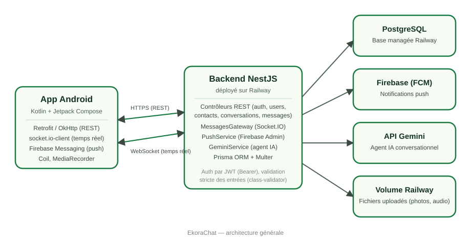
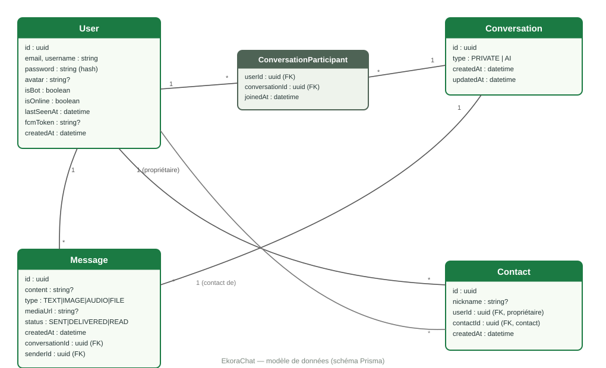
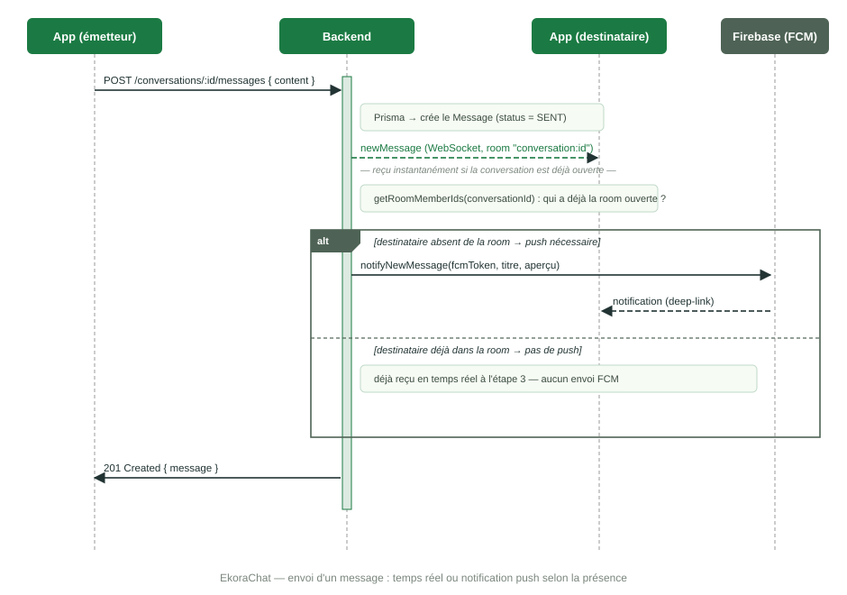

# Architecture — EkoraChat

## Vue d'ensemble

EkoraChat est composé de deux applications qui communiquent par API REST et
WebSocket, plus deux services tiers (Firebase, Gemini) :

- **App Android** (Kotlin, Jetpack Compose) : interface utilisateur, appels
  REST via Retrofit, connexion temps réel via socket.io-client, réception
  des notifications push via Firebase Messaging.
- **Backend NestJS** (déployé sur Railway) : expose l'API REST, gère la
  connexion WebSocket (Socket.IO) pour le temps réel, orchestre l'envoi des
  notifications push et les réponses de l'agent IA.
- **PostgreSQL** (Railway) : persistance des utilisateurs, contacts,
  conversations et messages, via Prisma ORM.
- **Firebase Cloud Messaging** : notifications push quand un destinataire
  n'a pas l'application ouverte sur la conversation concernée.
- **API Gemini** : génère les réponses de l'agent IA conversationnel.

## Modèle de données

Points clés :
- `ConversationParticipant` est la table de jointure many-to-many entre
  `User` et `Conversation` (une conversation privée a deux participants, une
  conversation avec l'IA a l'utilisateur + le compte bot `ekora-ai`).
- `Contact` relie deux `User` (propriétaire → contact), avec un
  `nickname` optionnel.
- `Message.status` (`SENT` / `DELIVERED` / `READ`) porte les accusés de
  réception ; `DELIVERED` est prévu dans le schéma mais non utilisé pour
  l'instant (seuls `SENT` et `READ` sont pilotés).
- `User.fcmToken`, `isOnline` et `lastSeenAt` supportent respectivement les
  notifications push et la présence en ligne.

## Flux temps réel vs notification push

Le choix entre "l'autre utilisateur le voit tout de suite" et "il faut lui
envoyer une notification" se fait au moment de l'envoi d'un message :

Le serveur WebSocket (`MessagesGateway`) sait, via les rooms Socket.IO
(`conversation:<id>`), qui a la conversation ouverte à l'instant présent
(`getRoomMemberIds`). Si le destinataire y est déjà, il reçoit l'événement
`newMessage` en direct et aucune notification push n'est envoyée — évitant
les doublons. S'il ne l'a pas ouverte (app fermée, en arrière-plan, ou sur
un autre écran), une notification push Firebase est envoyée avec les
informations nécessaires pour ouvrir directement la bonne conversation au
clic (deep-link).

## Authentification et sécurité

- JWT (`passport-jwt`) : chaque requête REST et chaque connexion WebSocket
  (au handshake) sont authentifiées par un token Bearer signé côté serveur.
- Mots de passe hashés avec `bcrypt`.
- Validation stricte des entrées (`class-validator` / `class-transformer`) :
  emails et longueurs de champs contrôlés, rejet des champs non attendus
  (`forbidNonWhitelisted`), restrictions de format (ex. nom d'utilisateur
  limité à un jeu de caractères sûr).

## Stockage des fichiers

Les photos, messages vocaux et fichiers envoyés dans le chat, ainsi que les
photos de profil, sont stockés sur disque côté backend (Multer) et servis en
statique. En production, ce dossier est monté sur un volume Railway
persistant pour survivre aux redéploiements.
